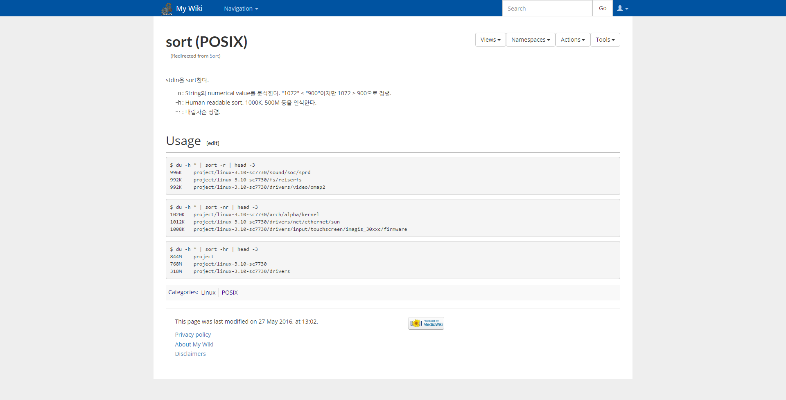

# Hanji

Minimalistic, responsive MediaWiki skin

Inspired by [Namu Wiki](https://namu.wiki)

Hanji is in development now. It looks nice on normal pages, but needs more work on special ones.

## Requirements
Mediawiki 1.25 and above

## Install
Clone this repository on your mediawiki `skins` directory.

Then rename the directory as `Hanji`.

Add the following in your `LocalSettings.php`:
```php
require_once "$IP/skins/hanji-mediawiki/Hanji.php";
```

Done!

[Check here](https://www.mediawiki.org/wiki/Manual:Skin_configuration) for more information.
## License
GPL-2.0+

Refer to the LICENSE file.
